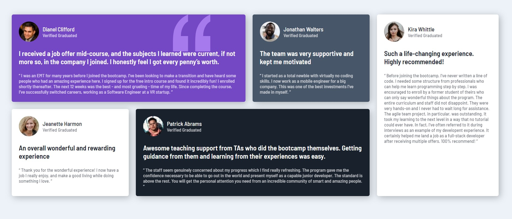

# [Frontend Mentor Challenge] Testimonials grid section solution

## Table of contents

- [[Frontend Mentor Challenge] Testimonials grid section solution](#frontend-mentor-challenge-testimonials-grid-section-solution)
  - [Table of contents](#table-of-contents)
  - [Overview](#overview)
    - [The challenge](#the-challenge)
    - [Screenshot](#screenshot)
    - [Links](#links)
  - [My process](#my-process)
    - [Built with](#built-with)
    - [What I learned](#what-i-learned)
    - [Useful resources](#useful-resources)
  - [Author](#author)

---
## Overview

### The challenge

Users should be able to:

- View the optimal layout for the site depending on their device's screen size

### Screenshot
- Desktop Design 

- Mobile Design
  
### Links

- Live Site URL: [Testmonials Grid Section](https://victorchao996.github.io/Frontend-Challenge_Testmonials_grid_section/)

---
## My process

### Built with

- Semantic HTML5 markup
- CSS custom properties
- Flexbox
- Mobile-first workflow

### What I learned
1. CSS shorthand example(2 values)
```css
  div{
    /* : top & bottom、right & left */
    padding: 5px 3px; 
    margin: 0 auto; /*easy way to center item in container*/
  }
```
2. Response Web Design using mediaquery
```css
  @media(min-width: 576px){
    /* some content here */
  }
```
3. flexbox
```css
  .itemContainer{
    display: flex;
    flex-direction: column;
  }
  .items{
    flex-basis: 25%;
  }
```
4. Font settings
- open google fonts
- choose the fonts family and its weight
- copy the <link> and place it in the head of html document.
- set the fonts by {font-family}


### Useful resources

- [Frontend Web Development Bootcamp Course](https://www.youtube.com/watch?v=zJSY8tbf_ys&list=PLZhK8cHyKIZwz9kuGEtGCBBdrAOFofbWZ&index=1) - This is my first frontend learning videos that I watch on Youtube. I follow the videos to accomplish this challenge.
- [MDN web doc](https://developer.mozilla.org/index.html) - The MDN Web Docs site provides information about Open Web technologies 

## Author

<!-- - Website - [Add your name here](https://www.your-site.com) -->
- Frontend Mentor - [VictorChao](https://www.frontendmentor.io/profile/VictorChao996)


